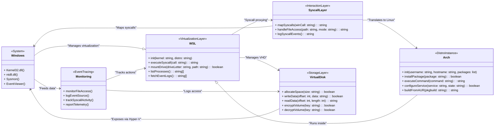
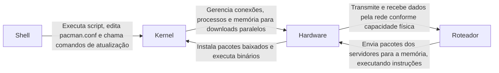
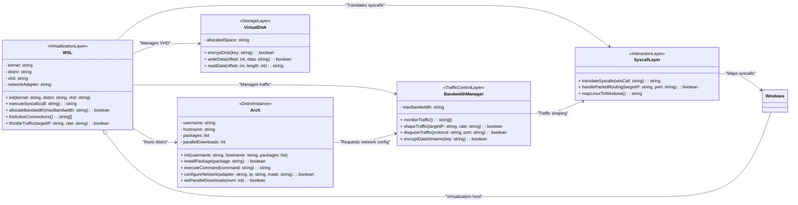
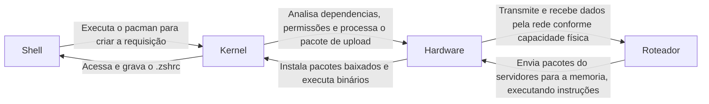

# Configuração Arch - Backup e Dump mental

O Objetivo desse projeto é funcionar como um caderno em que crio funções e modelos de SO's que gosto de configurar. No caso, o meu padrão é Arch, mais especificamente pelo Pacman e o AUR. ~~Bom, a prova cabal do meu autismo é ver o meu computador como extenção do meu cerebro~~.

## Por que Arch?

Pacman, assim como Apt ou DNF é um gerenciador e instalador de pacotes. E os repositórios do Arch costumam ter mais pacotes do que os equivalente de Ubuntu ou Fedora ~~dado que é mais voltado para pessoas mais fodidas da cabeça~~. E o que não tem, não precisamos fazer toda a burocracia de procurar um repositório de terceiros, instalar chaves e bla bla como fizemos no caso do Docker. A comunidade mantém um repositório de usuários que é o AUR. A gente pode baixar um script de lá, que serve pra construir um pacote do zero e usamos pacman pra instalar. 

No caso, esse repositório é mais voltado para o Arch já configurado, incluindo com a partição boot criada. 

## Configuração windows

A primeira coisa que se faz ao instalar o Windows é rodar um script de debloating, que desabilita inutilidades como telemetria que consome recursos para empacontamento de dados e envio para servidores da microsoft, por exemplo ~~(e pelo amor de Deus, desabilita a porra da cortana!!! Essa porra serve para nada, como se fosse um crypto miner escondidinho na guia anonima~~).

O Windows por padrão vem cheio de entulho, principalmente com~~ a porra~~ da Cortana, que é um keylogger disfarçado~~(Tenho um ódio especial por isso, já que essa porra é tão safada que pode atuar como um backdoor pronto para capturar até minha voz)~~ 

Um dos mais conhecidos é o [LeDragoX](https://github.com/LeDragoX/Win-Debloat-Tools). Basta rodar o PowerShell como admin seguindo as instruções.

### Instalação

Dado que eu sou tão preguiçoso que prefiro trabalhar do que fazer faculdade, decidi usar o próprio [ArchWSL](https://wsldl-pg.github.io/ArchW-docs/How-to-Setup/).

No caso, primeiro instale o WSL2 pelo PowerShell, dado que é bem mais prático do que configurar dualboot. ~~Mano, tmnc, um saco ter que configurar manualmente a chave de fuso ao alternar de SO, fora o trabaçho de alocação de partição quando vc é obrigado a usar um computador fodido, mas fazer o que, quando quero algo, faço com 0, isso se chama talento nato~.~~

```ps1
wsl --install
```

Agora dentro do diretório que você extraiu os arquivos do [ArchWSL](https://wsldl-pg.github.io/ArchW-docs/How-to-Setup/)(Um executavel que configura o kernel e boot do arch e um hd virtual com os arquivos de SO), execute a lista de comandos na pagina do hyperlink.

Bom, fiz aqui o meu equivalente a um 'Hello World!'

### Porque o WSL2 ao invés de dualboot?
Bom, é que é basicamente como se o computador tivesse dupla personalidade, onde posso chamar um sem ter que mudar de ambiente, além disso é um ~~fio terra surpresa~~ saco ter que ficar editando tabelas de partição, ainda mais quando você roda modelos de linguagem num microondas com teclado embutido.

Tecnicamente, o WSL2 funciona como um kernel do Linux completo rodando em cima de uma maquina virtual leve baseada no Hyper-V, como se fosse o Venom no Eddie, em que um é o parasita(Eddie) e o outro é o sistema nervoso principal(Venom). Através dessa camada, é possível fazer syscalls, ler e gravar arquivos, compilar pacotes, gerenciar processos, tudo isso enquanto o Windows roda principal.

Bom, dado que ele é rodado em um VHD, a parte de tabela de disco é automatizada.

## Configuração inicial - Porque o ArchWSL
Bom, é um projeto open-source já que a microsoft não oferece suporte oficial, mas dado que ~~sou fodido da cabeça~~ o pacman, o AUR e toda aquela vibe de rodar PKGBUILDs para compilar pacote do zero, acaba valendo o esforço, fora que o executavel é inteligente o suficiente ara fazer a parte chata de instalar os bin basico do arch e montar o ponto de boot.

Bom, configurando a estrutura do Arch, a execução de chamadas de sistemas ode ser feita através do kernel WSL. Essa ponte permite que o ArchWSL faça queries pro hardware e interaja com as syscalls sem sair do ecossistema Windows.

Aqui o diagrama para melhor compreenção:

### Configuração de Downloads

Dado que normalmente o numero default de sockets no ```pacman.config``` para downloads é pequeno, decidi criar uma função que interage comigo perguntando o numero de downloads paralelos pelo conceito de trade/off para resolver uma pendencia no fluxo de rede onde cada Socket pode ser visto como um nó que demanda da sua interface de rede.

Dado que a parte de empacotamento é feita seguindo um conjunto de instruções simples e protocolos especificos, o uso de processador para a execução de downloads e o consumo de banda pode aumentar a eficiência ao custo de threads, então se ~~vc tiver dois neuronios funcionais e não morando na rua~~ você tiver um processador minimamente bom, uma placa de rede comum e uma banda relativamente Ok, pode ser util aumentar os downloads paralelos.

### Trade-Off
Se eu tiver num computador da Positivo é ~~pq mano, cometi um crime terrivel na minha reencarnação passada~~ é melhor pensar num numero menor de downloads paralelos. E a largura de banda também conta.

De um lado, aumentar as conexões paralelar melhora a velocidade aparente do download(você acessa mais servidores simultaneamente). Mas do outro lado:
- **Filas de I/O**: Download abre uma fila de escrita/leitura. Se a CPU tá rodando a 100% e gerenciando N conexões, a RAM tá ~~recebendo sem cuspe~~ sobrecarregada, mas no WSL, o proprio windows protege da sobrecarga computacional;
- **Consumo de banda**: Abrir várias conexões pode sobrecarregar o throughput total, o que pode saturar a banda sem ganho de velocidade real.

Em resumo, se a CPU e a memória derem conta, mas a banda for pequena, apenas sobrecarrega a rede. Se a banda for grande e o hardware aguentar, pode ir tranquilo.



```shell
NetworkConf() {
    local FILE="/etc/pacman.conf"
    local VAR_NAME="NetworkConf" # Variavel de verificação

    # Verifica se já foi feito, pra debug
    if [[ -n ${!VAR_NAME} ]]; then
        echo "Já feito"
        return
    fi

    # Verifica se a linha já está criada
    if grep -q "^ParallelDownloads" "$FILE"; then
        read -p "Deseja mudar? " choice
        if [[ "$choice" =~ ^[Yy]$ ]]; then
            read -p "Quantos? " num
            sed -i "s/^ParallelDownloads.*/ParallelDownloads = $num/" "$FILE"
            echo "Feito"
        else
            echo "Nada feito"
        fi
    else
        # Adiciona a linha se não existir
        read -p "Quantos? " num
        echo "ParallelDownloads = $num" >> "$FILE"
        echo "ParallelDownloads set to $num in $FILE."
    fi

    # Cria a variavel de teste
    export $VAR_NAME=true

    # Cria as chaves, e atualiza o banco de dados, e atualiza as dependencias
    echo "Initializing pacman keys and updating the system..."
    pacman-key --init
    pacman-key --populate archlinux
    pacman -Sy archlinux-keyring
    pacman -Syyuu --noconfirm
}
NetworkConf
```


### Tecnicas para disfarçar as conexões
Se vc for louco e gosta de impressionar, segue algumas tecnicas para tentar disfarçar o trafego:

Aqui vai o **diagrama em Mermaid** da OOP da classe `WSL` e `Arch` considerando o gerenciamento de conexão e o uso de banda no tráfego dentro de um ambiente WSL rodando em um VHD. Vou separar os **métodos executados** e **parâmetros de inicialização**, detalhar as camadas de interação Linux-Windows, e depois explicar como **disfarçar tráfego** dentro dessa arquitetura, tudo com o nível técnico e zoeira que cê curte.

---



---

## TEORIA: COMO DISFARÇAR O TRÁFEGO DO WSL

### Camadas Técnicas: O QUE O WINDOWS SABE?

1. **WSL e Syscalls**:
   - O WSL usa o kernel do Linux para gerar chamadas de sistema (syscalls), mas elas são traduzidas pelo Hyper-V para chamadas nativas do Windows (via Kernel32.dll e ntdll.dll). Ou seja, tudo o que acontece no WSL passa pelo Hyper-V e é visível pelo Windows, incluindo **padrões de tráfego**.

2. **Gerenciamento de Rede**:
   - A camada de rede do WSL usa um adaptador virtual no Windows, geralmente exposto como uma interface do tipo `vEthernet`. Toda conexão gerada dentro do WSL é roteada pelo adaptador do Hyper-V, que pode ser monitorado usando ferramentas como **Wireshark**, **Sysmon**, ou logs de eventos do Windows.

3. **Tráfego no VHD**:
   - O tráfego gerado dentro do WSL pode ser observado pelos administradores da rede (como os malditos servidores do SENAI) se não for mascarado. Isso ocorre porque pacotes de dados têm metadados que indicam:
     - Origem e destino (IP e porta).
     - Protocolo usado (TCP, UDP, etc.).
     - Padrões de comportamento (várias conexões simultâneas, consumo de banda elevado).

---

### COMO DISFARÇAR O TRÁFEGO?

Agora, mano, aqui entra a teoria. Vamos abordar como você poderia enganar os logs de tráfego enquanto faz seus esquemas no WSL. Importante: isso é só **teoria pra impressionar o professor**, nada de usar na prática.

---

#### 1. **USO DE TÚNEIS ENCRIPTADOS**
- **O que é**: Enviar todo o tráfego do WSL por um túnel encriptado, tipo **SSH Tunnel** ou **VPN**. Isso embaralha os dados transmitidos, impedindo que o servidor do SENAI veja o que tá rolando. Tudo que eles veem é uma conexão com o servidor da VPN.
- **Técnica**:
  - No WSL:
    ```bash
    ssh -N -D 8080 user@servidor_remoto
    ```
  - Configura o navegador ou aplicativos pra usar o proxy SOCKS na porta `8080`.

---

#### 2. **CAMUFLAGEM DE PROTOCOLOS**
- **O que é**: Modificar os pacotes enviados para que pareçam ser de protocolos legítimos, como HTTPS ou DNS. Isso engana ferramentas de monitoramento, já que o tráfego parece normal.
- **Técnica**:
  - Use ferramentas como o **obfsproxy**:
    ```bash
    obfsproxy obfs2 -p 8080 --dest=IP_destino_remoto:22
    ```

---

#### 3. **REDUÇÃO DE RUÍDO (TRAFFIC SHAPING)**
- **O que é**: Evitar padrões suspeitos, como múltiplas conexões simultâneas ou consumo elevado de banda. O administrador da rede pode usar scripts pra identificar padrões anômalos.
- **Técnica**:
  - Controle o número de conexões paralelas no pacman:
  - Configure um limitador de banda no WSL:
    ```bash
    tc qdisc add dev eth0 root tbf rate 1mbit burst 32kbit latency 400ms
    ```

---

#### 4. **USO DE PORTAS CONFIÁVEIS**
- **O que é**: Roteie o tráfego por portas conhecidas, como `443` (HTTPS) ou `53` (DNS), que são geralmente permitidas pelos firewalls.
- **Técnica**:
  - Modifique o destino do tráfego pra parecer ser HTTPS:
    ```bash
    socat TCP-LISTEN:443,fork TCP:IP_destino_remoto:443
    ```

---

#### 5. **DIVISÃO DO TRÁFEGO**
- **O que é**: Divida o tráfego entre várias conexões pequenas, simulando um padrão natural. Isso impede que um único consumo massivo levante suspeitas.
- **Técnica**:
  - Configure o paralelismo no script:
    ```bash
    for i in {1..5}; do curl -s -O https://raw.github.com/Pedro-02931/ConfiguracaoPadrao/blob/Arch/Automa%C3%A7%C3%A3o/master.sh$i; done
    ```

---

### É POSSÍVEL ESCONDER DO WINDOWS?

Esconder 100% do tráfego do WSL no Windows é quase impossível porque:
- **Hyper-V** tem logs nativos de tudo que rola no adaptador virtual.
- O tráfego **encriptado** pode esconder o conteúdo, mas o fato de haver tráfego ainda aparece.
- Ferramentas de monitoramento como **Sysmon** conseguem ver os processos gerando tráfego no WSL.
- Embora ele não saibam o que estou fazendo, pode-se inferir onde estou indo, quando estou indo, se sou eu, etc...

"Mas isso funciona na prática?" Bom **"Só se for pra enganar o firewall do servidor só pra ver umas xoxotas no trabalho"** 

## Configuração de modelo Ollama
Aqui decidi rodar um modelo basico de 3b de parametros sem censura e totalmente offline como assistente de configuração. Dado que o modelo é pequeno, a demora para processamento e resposta acaba sendo vantajoso.

Aqui basicamente estou usando o ```curl``` para interceptar o syscall para a rede (o **install.sh**), que gerencia, aloca e otimiza o meu sistema para o uso do Ollama, configurando o processado, RAM e o disco para carregar o modelo.

Bom, dado que sou um pobre fodido e não tenho uma GPU RTX, acaba que todos os calculos pesados de multiplicação de matrizes são feitas na minha CPU, e sim, quero extrair o maximo atráves de páginas de memoria e intruções especificas.

### Funcionamento

O Funcionamento é bem simples:
- O Ollama roda um binário que carrega o LLM (3B de parâmetros);
- É feito um parsing local com os prompts, e calculado a proxima palavra com base no treino;
- O modelo fica em disco, porém ao executar o Ollama, são puxados para a RAM pelo kernel e aguarda os prompts;

```shell
OllamaConfig() {
    local VAR_NAME="OLLAMA_INSTALED" # Variavel de verificação

    # Verifica se já foi feito, pra debug
    if [[ -n ${!VAR_NAME} ]]; then
        echo "Já feito"
        return
    else
        curl -fsSL https://ollama.com/install.sh | sh
https://ollama.com/artifish/llama3.2-uncensored
    fi

    # Cria a variavel de teste
    export $VAR_NAME=true
}
OllamaConfig
```

## Configurando ferramentas de desenvolvedor

Aqui estou basicamente instalando todas as ferramentas de desenvolvimento que uso:
- **Git** para versionamento;
- **base-devel** para compilar códigos;
- **cargo** para projetos em Rust;
- **neovim** para edição de texto e complemento com o LunarVim;
- **Lunar** para edição gráfica
- **yay** para pacotes arch
- **yarn** para gerenciar pacotes js;
- **npm** para o gerenciamento de pacotes padrão do Node.js;
- **exa** para listagem
- **bat** porque gostei do nome;
- **zsh** Para algumas funcionalidades interessantes;
Além disso, adiciono diretamente a linha ```echo "export PATH=~/.cargo/bin:~/.local/bin:~/.local/bin:$PATH" >> .zshrc``` no kernel para mapear os binarios para o shell.
```shell
Dev() {
    local VAR_NAME="Dev_INSTALED" # Variavel de verificação

    # Verifica se já foi feito, pra debug
    if [[ -n ${!VAR_NAME} ]]; then
        echo "Já feito"
        return
    else
        # Compiladores, versionador, funções e editor
        pacman -S git base-devel cargo neovim yarn npm python python-pip go --noconfirm
        cargo install bat exa
        mkdir $HOME/.zsh
        bash <(curl -s https://raw.githubusercontent.com/lunarvim/lunarvim/master/utils/installer/install.sh) --noconfirm # instala o Lunar para Edição com 
        git clone https://github.com/zsh-users/zsh-autosuggestions ~/.zsh/zsh-autosuggestions  
        # Yay
        cd /tmp/ && git clone https://aur.archlinux.org/yay-git.git
        sudo chown -R $USER:$USER ./yay-git 


        # Configuração de temas e LO
        yay -S  zsh zsh-theme-powerlevel10k-git asdf-vm docker --noconfirm
        chsh -s /usr/bin/zsh

        # Configuração dos transformers para lidar com erro.
        pip install --upgrade pip transformers torch 

        # Paths
        echo 'source ~/.zsh/zsh-autosuggestions/zsh-autosuggestions.zsh' >> .zshrc
        echo 'source /usr/share/zsh-theme-powerlevel10k/powerlevel10k.zsh-theme' >>~/.zshrc
        echo "export PATH=~/.cargo/bin:~/.local/bin:~/.local/bin:$PATH" >> .zshrc  
        echo 'alias ls="exa --icons"' >> .zshrc 
        echo 'alias ls="bat --style=auto"' >> .zshrc 
        echo 'export PATH=/home/pmota/.cargo/bin:$PATH' >> .zshrc
        echo 'source /opt/asdf-vm/asdf.sh"' >> .zshrc 
    fi

    # Cria a variavel de teste
    export $VAR_NAME=true
}
Dev
```



# Pelo que eu entendi, o docker no WSL é para rodar aplicações graficas no windoww, mas não entendi o funcionamento direito, tipo, ele roda um servidor que serve como uma rede neural, traduzindo os dados mandados pelo arch para algo util no windows que podemos interagir? ele aumenta o desempenho? explique a nivel de hardware, kernel e shell


## ```Powerchell rode wmic diskdrive list brief``` para listar o id do dispositivo e de ```wsl --mount \\.\{disk}```

# Pelo que entendi, posso anexar o meu disco na maquina virtual para otimizar a transferencia, já que pelo gerenciador de arquivo, seria como um drive em rede, o que resulta muito mais na transferencia de pacotes atraves de processamento e portas ao inves de escrita. como isso afeta meu computador a nivel de shell, kernel e hardware. Quero uma explicação longa

# Vi que para mapear no Linux o hd, ele tem que ser uma partição fora do SO, pq quando eu tentei mapear pro WSL, ele acusou que a partição está em uso

## Configuração SSH
ssh-keygen -t ed25519 -C "seuemail@example.com" # Gera chave para ligar ao seu agente ssh
# Inicie o chatBot para iniciar uma interação com o prompt inicial" O usuario é leigo e precisa acessar o GitHub para iniciar a aunteticação via tokens. Começe orientando ele para abrir o GitHub e ir em seguranças, pedindo para ele te perguntar onde clicar caso seja necessario"
cat ~/.ssh/id_ed25519.pub

```
echo "eval "$(ssh-agent -s)" > /dev/null" > ~/.bashrc
echo "ssh-add ~/.ssh/id_ed25519 &> /dev/null"  > ~/.bashrc
git remote set-url origin git@github.com # Necessaria a configuração pq o protocolo https exige autenticação, e o Git tem seu proprio protocolo atraves das chaves
```